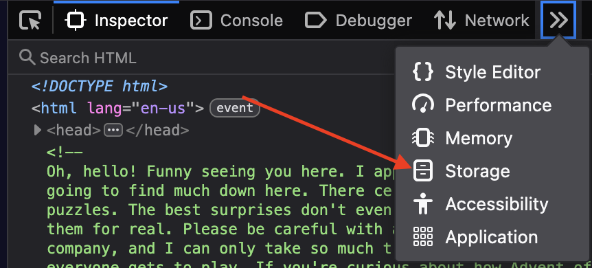
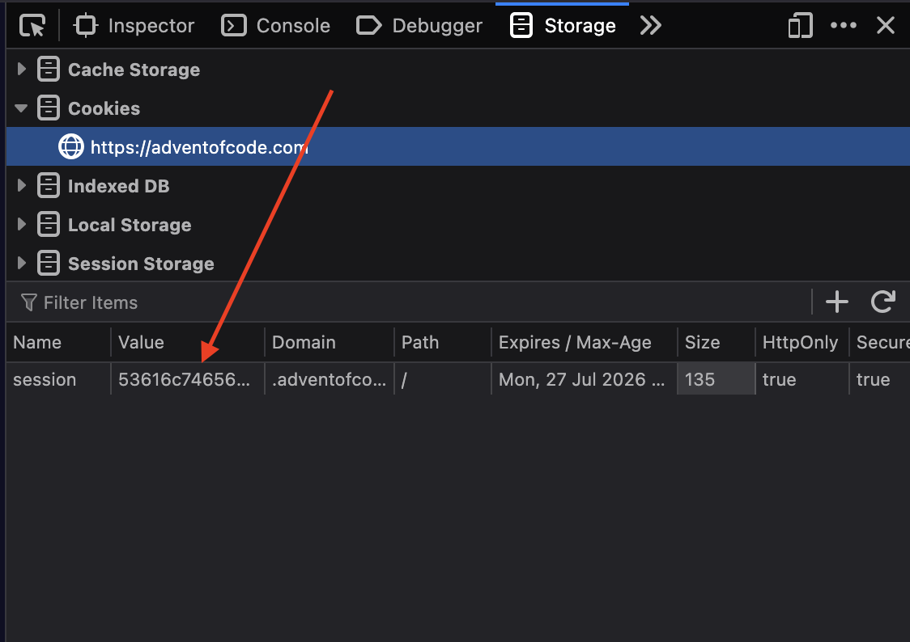

# Happy Father's Day

This repository holds both my (@alexhrao) and my dad's (@udaykrao) implementations
for the Advent of Code, 2021

## Getting Started

Make sure you've [Installed the VSCode CLI](https://stackoverflow.com/questions/29963617/how-to-call-vs-code-editor-from-terminal-command-line).

And install the compilers that you will need:

``` zsh
curl https://sh.rustup.rs -sSf | sh -s -- -y
brew install go
brew install node
```

Then, to get started:

1. Pick a day you want to start on, and a language you want to use
2. Run `./setup.py DAY LANG USER` to create the correct directory structure and start up a new editor

## Example

Suppose we're starting day 2 and this time want to use Rust

``` zsh
./setup.py 2 rust ahr
```

Creates a new directory in `day02` and gets you started!

## Getting Inputs

Make sure you've [Gotten your session cookie](#getting-your-session-cookie) first. Then, run `./fetch.py` with the day you want. For example, the fifth day would be:

``` zsh
./fetch.py 5
```

This places day 5's input in `inputs/day05.txt`.

## Picking a winner

To run all the entries for a given day, use `run.py`. To run the latest day, do `run.py DAY`; otherwise, it picks the latest day for which there is an attempt.

``` zsh
./run.py 5 # Runs the fifth day
```

## Getting your session cookie

After you've logged in, open the Developer tools and navigate to the Storage tab:



Then go to the cookies and copy the value of the cookie:



Paste that value into a file called `auth.txt` in this directory
